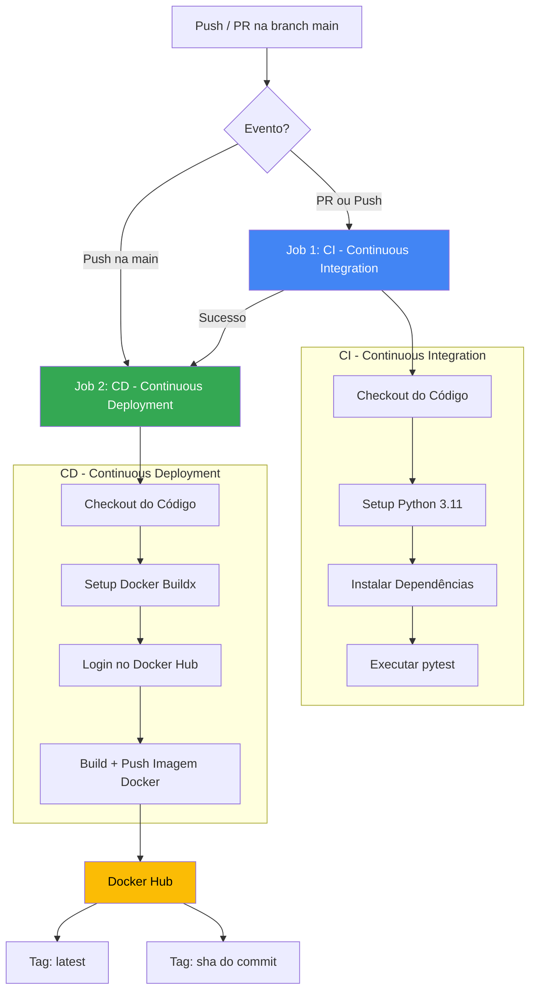

# 🚀 Portfólio DevOps/SRE - Nível Júnior

> Projeto de portfólio demonstrando boas práticas de Engenharia DevOps/SRE, incluindo Python tipado, testes automatizados com pytest, Dockerização e pipeline CI/CD com GitHub Actions.

---

## 📋 Sumário

- [Sobre o Projeto](#sobre-o-projeto)
- [Tecnologias Utilizadas](#tecnologias-utilizadas)
- [Estrutura de Arquivos](#estrutura-de-arquivos)
- [Arquitetura e Fluxo CI/CD](#arquitetura-e-fluxo-cicd)
- [Pré-requisitos](#pré-requisitos)
- [Como Rodar Localmente (Sem Docker)](#como-rodar-localmente-sem-docker)
- [Como Rodar com Docker](#como-rodar-com-docker)
- [Como Executar os Testes](#como-executar-os-testes)
- [Configuração do GitHub Actions](#configuração-do-github-actions)
- [Secrets Necessários](#secrets-necessários)
- [Evidências e Screenshots](#evidências-e-screenshots)
- [Referências](#referências)

---

## 📖 Sobre o Projeto

Este repositório foi criado como um projeto de portfólio para a posição de **DevOps/SRE Júnior**, demonstrando as seguintes habilidades:

✅ **Python com Type Hints** - Código limpo e tipado seguindo boas práticas  
✅ **Testes Automatizados** - Cobertura de testes unitários com `pytest`  
✅ **Docker** - Containerização com imagem otimizada (`python:3.11-slim`)  
✅ **CI/CD** - Pipeline completo com GitHub Actions (CI + CD para Docker Hub)  
✅ **Versionamento** - Tags de imagem com `latest` e `sha` do commit  

---

## 🛠️ Tecnologias Utilizadas

| Tecnologia       | Versão        | Descrição                              |
|------------------|---------------|----------------------------------------|
| Python           | 3.11          | Linguagem principal da aplicação       |
| pytest           | 8.3.3         | Framework de testes                    |
| pytest-cov       | 5.0.0         | Cobertura de testes                    |
| Docker           | +24.x         | Containerização da aplicação           |
| GitHub Actions   | -             | Orquestração do pipeline CI/CD         |
| Docker Hub       | -             | Registro de imagens Docker             |

---

## 📁 Estrutura de Arquivos

```
portifolio-devops/
├── .github/
│   └── workflows/
│       └── main.yml              # Pipeline CI/CD (GitHub Actions)
├── src/
│   └── main.py                   # Módulo principal (Python tipado)
├── tests/
│   └── test_main.py              # Testes unitários (pytest)
├── .gitignore                    # Arquivos ignorados pelo Git
├── Dockerfile                    # Definição da imagem Docker
├── README.md                     # Documentação do projeto
└── requirements.txt              # Dependências Python
```

---

## 🏗️ Arquitetura e Fluxo CI/CD

### Diagrama do Pipeline



### Explicação do Fluxo

| Etapa | Descrição |
|-------|-----------|
| **Trigger** | Qualquer `push` ou `pull_request` direcionado à branch `main` inicia o pipeline. |
| **Job 1 - CI** | Roda SEMPRE (push e PR). Instala as dependências e executa a suíte de testes com `pytest` para validar o código. |
| **Job 2 - CD** | Roda APENAS se o Job 1 passar e somente em caso de `push` direto na `main`. Faz login no Docker Hub e publica a imagem com duas tags. |

---

## ✅ Pré-requisitos

Antes de começar, certifique-se de ter instalado:

- [Python 3.11+](https://www.python.org/downloads/)
- [Git](https://git-scm.com/)
- [Docker](https://www.docker.com/get-started) (opcional, se for rodar com contêiner)

---

## 🖥️ Como Rodar Localmente (Sem Docker)

### 1. Clone o repositório

```bash
git clone https://github.com/RickTheBoy-ops/Portif-lio-DevOps.git
cd portifolio-devops
```

### 2. Crie um ambiente virtual

```bash
python -m venv venv
source venv/bin/activate   # Linux/Mac
# ou
.\venv\Scripts\activate    # Windows
```

### 3. Instale as dependências

```bash
pip install --upgrade pip
pip install -r requirements.txt
```

### 4. Execute a aplicação

```bash
export PYTHONPATH=$PWD
python src/main.py
```

**Saída esperada:**

```
Portfólio DevOps/SRE - Módulo Principal
2 + 3 = 5
10 - 4 = 6
5 * 6 = 30
20 / 4 = 5.0
Média de [1,2,3,4,5] = 3.0
4 é par? True
17 é primo? True
'DevOps' invertido = 'spOveD'
Vogais em 'Hello World' = 3
'teste@exemplo.com' é válido? True
Fatorial de 5 = 120
Fibonacci(10) = [0, 1, 1, 2, 3, 5, 8, 13, 21, 34]
Índice de 'DevOps' em ['CI', 'CD', 'DevOps'] = 2
```

---

## 🐳 Como Rodar com Docker

### 1. Build da imagem

```bash
docker build -t portfolio-devops:local .
```

### 2. Execute o contêiner

```bash
docker run --rm portfolio-devops:local
```

---

## 🧪 Como Executar os Testes

### Opção 1: Rodar diretamente (sem relatório)

```bash
export PYTHONPATH=$PWD
pytest tests/ -v
```

### Opção 2: Rodar com cobertura de código

```bash
export PYTHONPATH=$PWD
pytest tests/ -v --cov=src --cov-report=term-missing
```

### Opção 3: Rodar via Docker

```bash
docker build -t portfolio-devops:test .
docker run --rm portfolio-devops:test python -m pytest tests/ -v
```

---

## ⚙️ Configuração do GitHub Actions

O pipeline está definido em `.github/workflows/main.yml` e contém 2 jobs:

### Job 1: `ci` (Continuous Integration)

- **Quando roda**: Push e PRs para `main`
- **Passos**:
  1. Checkout do código
  2. Setup Python 3.11
  3. Instala dependências com `--no-cache-dir`
  4. Executa `pytest` com verbosidade

### Job 2: `cd` (Continuous Deployment)

- **Quando roda**: Apenas após sucesso do Job 1, e apenas em Push na `main`
- **Passos**:
  1. Checkout do código
  2. Setup Docker Buildx
  3. Login no Docker Hub (via secrets)
  4. Build e Push da imagem Docker com as tags:
     - `DOCKERHUB_USERNAME/portfolio-devops:latest`
     - `DOCKERHUB_USERNAME/portfolio-devops:${{ github.sha }}`

---

## 🔐 Secrets Necessários

Para o Job de CD funcionar, você deve configurar as seguintes **Secrets** no repositório do GitHub:

### Como configurar:

1. Acesse `Settings > Secrets and variables > Actions > New repository secret`
2. Adicione as secrets abaixo:

| Secret                  | Valor                                                    |
|-------------------------|----------------------------------------------------------|
| `DOCKERHUB_USERNAME`    | Seu nome de usuário do Docker Hub                        |
| `DOCKERHUB_TOKEN`       | Token de acesso criado em `Docker Hub > Account Settings > Security > Access Tokens` |

---

## 📸 Evidências e Screenshots

### 1. Pipeline CI/CD - GitHub Actions

> 📍 **PLACEHOLDER**: Cole aqui o print de tela mostrando o pipeline do GitHub Actions passando (Jobs CI e CD com status verde ✅).


**O que a evidência deve mostrar:**
- Job `ci` com status ✅ (sucesso)
- Job `cd` com status ✅ (sucesso, se foi push na main)
- Log do pytest mostrando todos os testes passando

---

### 2. Log do Job CI (pytest)

> 📍 **PLACEHOLDER**: Cole aqui o print de tela do log do Job CI mostrando todos os testes passando.


**O que a evidência deve mostrar:**
- Saída do `pytest -v` com `passed` em todos os testes

---

### 3. Imagem no Docker Hub

> 📍 **PLACEHOLDER**: Cole aqui o print de tela mostrando a imagem publicada no Docker Hub.


**O que a evidência deve mostrar:**
- Repositório com a imagem `portfolio-devops`
- Pelo menos 2 tags: `latest` e o SHA do commit
- Horário da publicação recente

---

### 4. Teste Local com Docker

> 📍 **PLACEHOLDER**: Cole aqui o print de tela do comando `docker run` com a saída da aplicação.


---

## 📚 Referências

- [Python 3.11 Documentation](https://docs.python.org/3.11/)
- [pytest Documentation](https://docs.pytest.org/)
- [Dockerfile Reference](https://docs.docker.com/engine/reference/builder/)
- [GitHub Actions Documentation](https://docs.github.com/pt/actions)
- [Docker Hub](https://hub.docker.com/)

---

## 🎯 Conclusão

Este projeto demonstra a base fundamental de um Engenheiro DevOps/SRE Júnior:

- ✅ Código limpo, tipado e testável em Python
- ✅ Testes automatizados executados em pipeline
- ✅ Containerização com boas práticas de Docker
- ✅ CI/CD completo (integração e entrega contínua)
- ✅ Publicação automática de imagens no Docker Hub

---

> **Feito por** | [Erick Silva]  
> **Perfil LinkedIn:** | [www.linkedin.com/in/erick-vinicius-3b9410197]  
